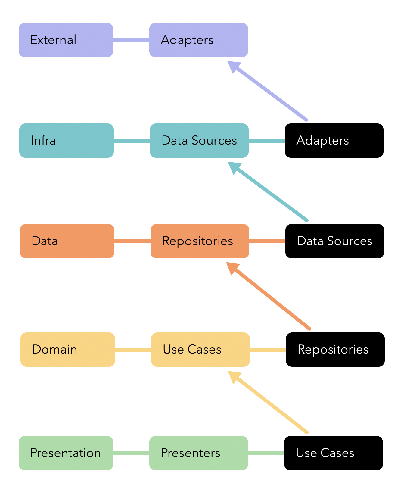
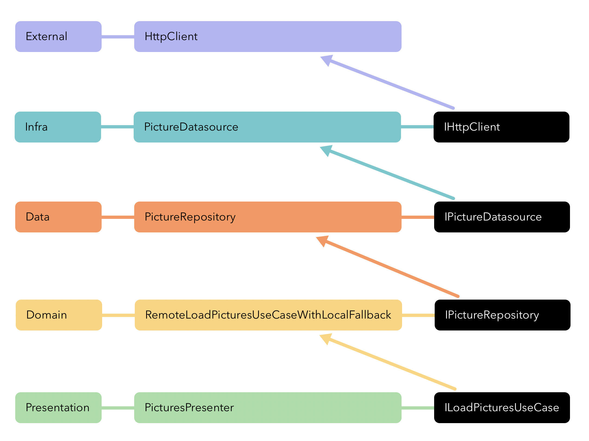
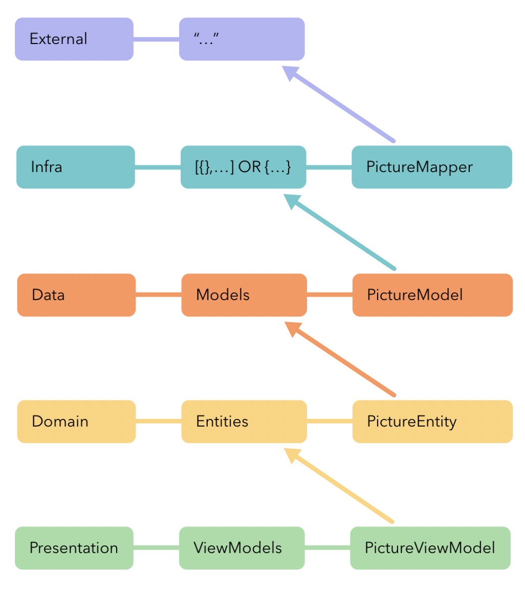
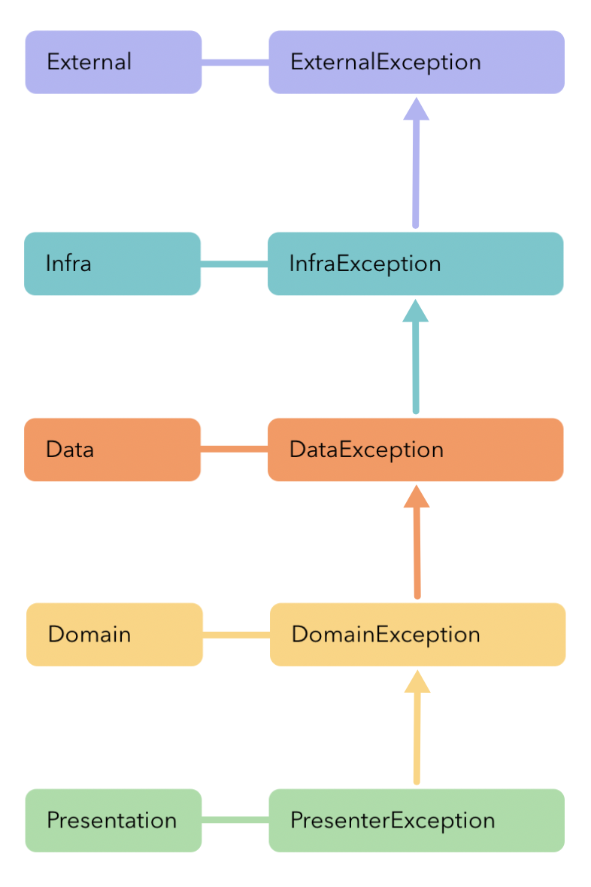
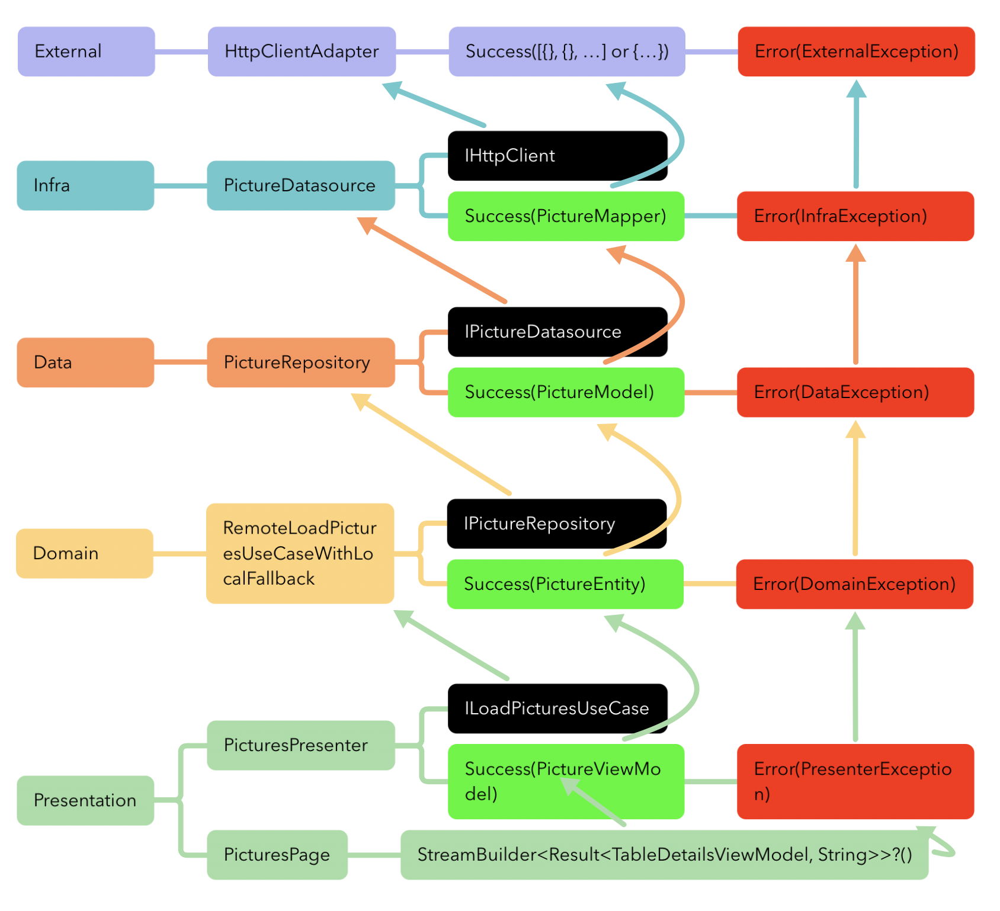

# Cloudwalk Interview Test: Mobile Engineer 2

Interview test reference: https://gist.github.com/cloudwalk-tests/68db9331919d02c16b1e05c5daa0364f

This repository contains the implementation of a mobile application following the Clean Architecture principles. The architecture is organized into separate layers to ensure modularity, maintainability, and testability. Below is a step-by-step guide outlining the key aspects of the project development.

# Quick Start

```shell
   cd nasa_apod_app
   dart run build_runner build --delete-conflicting-outputs
```

```shell
   flutter run
```

# Have any issue? Run on web:

```shell
   flutter run -d chrome --web-renderer html
```

## Step 1: Documentation

### Usecases

In this phase, the project's use cases are defined. Usecases represent the high-level functionalities of the application. Each use case describes a specific action or behavior that the application must support.

### Behavior-Driven Development (BDD)

BDD scenarios are created to specify the expected behavior of the application in various scenarios. These scenarios help ensure that the development process aligns with the desired outcomes and requirements.

## Step 2: Test-Driven Development (TDD)

### Scenarios

TDD scenarios are derived from the BDD scenarios. These scenarios are transformed into test cases that drive the development process. Each test case corresponds to a specific use case and serves as a blueprint for writing code.

### Implementation

Based on the TDD scenarios, the implementation of each use case is carried out. The implementation process focuses on fulfilling the requirements outlined in the scenarios, ensuring that the code meets the expected functionality.

## Step 3: Separating Project by Layers



### Domain Layer

The domain layer contains the core business logic of the application. It defines entities, use case interfaces, and business rules. This layer is independent of external frameworks and technologies.

### Data Layer

The data layer is responsible for data management and storage. It implements the use case interfaces defined in the domain layer and interacts with data sources such as databases, APIs, or repositories.

### Infrastructure Layer

The infrastructure layer provides the necessary tools and libraries to support the application's operation. It includes implementations of data sources, networking components, and other technical infrastructure details.

### External Layer

The external layer encompasses external dependencies, such as third-party libraries, frameworks, and services. This layer encapsulates the interactions with external components, promoting loose coupling and maintainability.

### Presentation Layer

The presentation layer handles the user interface and user interaction. It includes components for displaying information and receiving user input. This layer communicates with the domain layer through use case interfaces.

### Main Layer

The main layer serves as the entry point of the application. It initializes the necessary components, sets up dependency injection, and coordinates the interactions between different layers.









By organizing the project into these distinct layers, the Clean Architecture approach promotes code separation, reusability, and testability. This structure enables the development team to make changes to specific parts of the application without affecting the entire system.

Feel free to explore each layer in detail within the repository to understand how the architecture is implemented and how the different components interact.

For any questions or assistance, please contact Kevin Kobori at kevinyujikobori@gmail.com.
